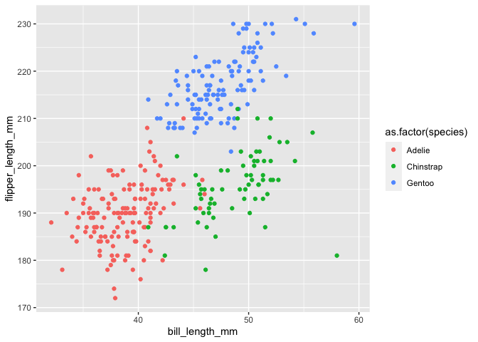

Homework 1
================
Jiayi Zhou

This is my solution to HW1.

``` r
library(tidyverse)
```

    ## ── Attaching packages ───────────────────────────────────────────────────────── tidyverse 1.3.0 ──

    ## ✓ ggplot2 3.3.0     ✓ purrr   0.3.4
    ## ✓ tibble  3.0.1     ✓ dplyr   0.8.5
    ## ✓ tidyr   1.0.3     ✓ stringr 1.4.0
    ## ✓ readr   1.3.1     ✓ forcats 0.5.0

    ## ── Conflicts ──────────────────────────────────────────────────────────── tidyverse_conflicts() ──
    ## x dplyr::filter() masks stats::filter()
    ## x dplyr::lag()    masks stats::lag()

## Problem 1

Create a data frame with specified elements

``` r
prob1_df = 
  tibble(
    samp = rnorm(10),
    logi_vec = samp > 0,
    char_vec = c("a", "b", "c", "d", "e", "f", "g", "h", "i", "j"),
    fac_vec = factor(c("low", "low", "low", "low", "mod", "mod", "mod", "high", "high", "high"))
  )
```

Take the mean of each variable in my data frame.

``` r
mean(pull(prob1_df, samp))
```

    ## [1] 0.1598696

``` r
mean(pull(prob1_df, logi_vec))
```

    ## [1] 0.5

``` r
mean(pull(prob1_df, char_vec))
```

    ## Warning in mean.default(pull(prob1_df, char_vec)): argument is not numeric or
    ## logical: returning NA

    ## [1] NA

``` r
mean(pull(prob1_df, fac_vec))
```

    ## Warning in mean.default(pull(prob1_df, fac_vec)): argument is not numeric or
    ## logical: returning NA

    ## [1] NA

I can take the mean of numerical and logical variables but not character
or factor.

``` r
as.numeric(pull(prob1_df, samp))
```

    ##  [1] -0.18399349  0.23707559  0.06232524  1.50438748 -0.21423211 -0.49648576
    ##  [7]  1.10335603 -1.38190416 -0.73640854  1.70457562

``` r
as.numeric(pull(prob1_df, logi_vec))
```

    ##  [1] 0 1 1 1 0 0 1 0 0 1

``` r
as.numeric(pull(prob1_df, char_vec))
```

    ## Warning: NAs introduced by coercion

    ##  [1] NA NA NA NA NA NA NA NA NA NA

``` r
as.numeric(pull(prob1_df, fac_vec))
```

    ##  [1] 2 2 2 2 3 3 3 1 1 1

converting logical vector to numeric vector, factor, and first to factor
then to numeric.

``` r
as.numeric(pull(prob1_df, logi_vec)) * pull(prob1_df, samp)
```

    ##  [1] 0.00000000 0.23707559 0.06232524 1.50438748 0.00000000 0.00000000
    ##  [7] 1.10335603 0.00000000 0.00000000 1.70457562

``` r
as.factor(pull(prob1_df, logi_vec)) * pull(prob1_df, samp)
```

    ## Warning in Ops.factor(as.factor(pull(prob1_df, logi_vec)), pull(prob1_df, : '*'
    ## not meaningful for factors

    ##  [1] NA NA NA NA NA NA NA NA NA NA

``` r
as.numeric(as.factor(pull(prob1_df, logi_vec))) * pull(prob1_df, samp)
```

    ##  [1] -0.1839935  0.4741512  0.1246505  3.0087750 -0.2142321 -0.4964858
    ##  [7]  2.2067121 -1.3819042 -0.7364085  3.4091512

## Problem 2

Load the penguins data set.

``` r
data("penguins", package = "palmerpenguins")
```

In the penguins data set, there are 8 variables: species, island,
bill\_length\_mm, bill\_depth\_mm, flipper\_length\_mm, body\_mass\_g,
sex, year. In total, there are 344 sets of data. The mean flipper length
of the selected penguins is 200.9152047 with the unit of mm.

``` r
ggplot(penguins, aes(x = bill_length_mm, y = flipper_length_mm, color = as.factor(species))) + geom_point()
```

    ## Warning: Removed 2 rows containing missing values (geom_point).

<!-- -->

``` r
ggsave("penguins.png", width = 20, height = 20)
```

    ## Warning: Removed 2 rows containing missing values (geom_point).
